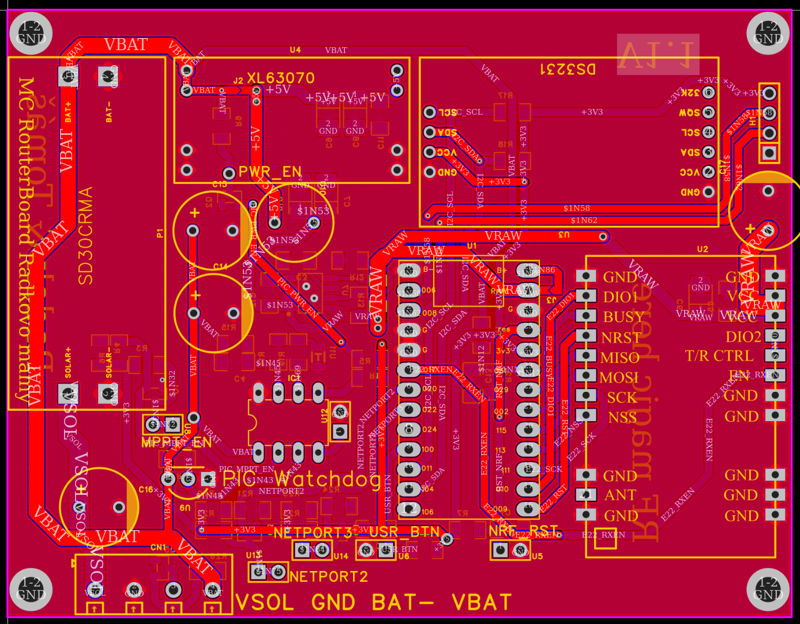
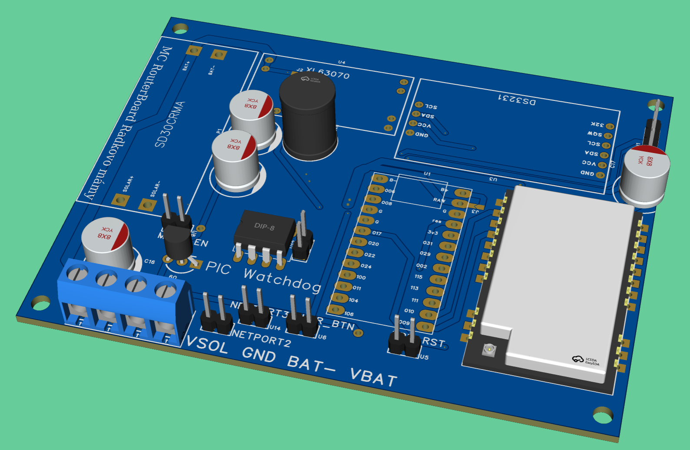

# MC Repeater Board - Rakovo Mámy

> **Note:** This project is a work in progress and not as polished as some of our other releases. Please keep this in mind if you plan on ordering or manufacturing the board.

This is a custom PCB designed to host the **E22P-868M30S** $1\text{W}$ LoRa transmission module. 

The board features an onboard solar MPPT charger (**SD30CRMA**), a carefully optimized power rail with robust filtering, a dedicated slot for a **DS3231** Real-Time Clock (RTC), and a **PIC12F** microcontroller dedicated to low-power management.

## Motivation

After *TvojeMama* released his original MC repeater board, *Radek* envisioned several hardware improvements. He drafted the core schematic, and I stepped in to complete the PCB routing and layout. 

---

## Hardware Preview

  
  

---

## Firmware (Work in Progress)

### nRF52840
The pinout is compatible with the generic nRF52 Nano v2.0 footprints. 
* **Project Base Documentation:** [MeshCore Repeatery (yomamesh)](https://meshcore.cz/doku.php?id=repeatery:yomamesh#v115_build_1942026_rozsirena_verze_o_pwrmgt_prikazy_a_bootlock_27v)
* **Firmware Repository:** [MeshCore Git - promicro_e22p variant](https://github.com/cncnet-info/MeshCore/tree/feature/promicro-e22p-fw-sync/variants/promicro_e22p)

### PIC Microcontroller
The onboard PIC handles watchdog features and power management sleep cycles.
* **Watchdog Firmware Repository:** [MeshCore_wdt Git](https://github.com/cncnet-info/MeshCore_wdt)

## BOM
This one is only for orintetation. Please refer to the BOM in the root.
|Name                                                     |Purpose                                               |Quantity|Total Cost (USD)|Link                                                                                              |Distributor|
|---------------------------------------------------------|------------------------------------------------------|--------|----------------|--------------------------------------------------------------------------------------------------|-----------|
|PCB                                                      |It holds everything tohether                          |1       |3.50            |                                                                                                  |JLCPCB     |
|JGNE 26650 3600mah - 10.2A LIFEPO4 - 3.2V / I already own|Non stop power                                        |2       |7.66            |https://www.nkon.nl/en/jgne-26650-3600mah-10-2a-lifepo4.html                                      |nkon       |
|FVE pannel 12V/10W                                       |Harvesting the powr of the sun                        |        |17.00           |https://www.hadex.cz/p/g949-fotovoltaicky-solarni-panel-12v-10w-polykrystalicky-370x250x17mm      |Hadex      |
|XL63070 5V                                               |Buck/Boost for main rail                              |1       |5.48            |https://www.aliexpress.com/item/1005004622491894.html                                             |Aliexpress |
|SD30CRMA 12V                                             |MPPT Charger                                          |1       |4.86            |https://www.aliexpress.com/item/1005005904054565.html                                             |Aliexpress |
|NRF52840                                                 |Brain of the operation                                |1       |5.05            |https://www.aliexpress.com/item/1005008715067918.html                                             |Aliexpress |
|DS3231                                                   |RTC for repeater time                                 |1       |2.98            |https://www.aliexpress.com/item/1005007143542894.html                                             |Aliexpress |
|ZHOURI PM2.54-1*10                                       |CONN SOCKET 10POS 2.54mm SINGLE ROW TH                |5       |0.53            |https://www.lcsc.com/product-detail/C5116489.html                                                 |LCSC       |
|BOOMELE(Boom Precision Elec) 2.54-1*10P                  |Headers for all the things                            |5       |0.70            |https://www.lcsc.com/product-detail/Pin-Headers_BOOMELE-Boom-Precision-Elec-2-54-1-10P_C57369.html|LCSC       |
|SI2302                                                   |N-Channel 20V 3.3A 1000mW                             |1       |0.51            |https://www.lcsc.com/product-detail/C20628873.html                                                |LCSC       |
|PB25V1000M8X17                                           |1000uF 25V                                            |1       |1.60            |https://www.lcsc.com/product-detail/C51934175.html                                                |LCSC       |
|DG301-5.0-04P-14-1000A(H)                                |POWER CONNECTOR                                       |1       |1.25            |https://www.lcsc.com/product-detail/C3037697.html                                                 |LCSC       |
|TAJB105K035RNJ                                           |1uF ±10% 35V Tantalum Capacitors 6.5Ω@100kHz          |5       |1.35            |https://www.lcsc.com/product-detail/C7192.html                                                    |LCSC       |
|DS18B20+T&R                                              |TEMP SENSOR                                           |1       |1.62            |https://www.lcsc.com/product-detail/C880672.html                                                  |LCSC       |
|MCP1727-ADJE/SN                                          |800mV~5V Positive Adjustable SOIC-8 Voltage Regulators|1       |2.38            |https://www.lcsc.com/product-detail/C635937.html                                                  |LCSC       |
|TSW-102-07-F-S                                           |Pin Header 2 Position 2.54mm Pitch                    |6       |1.63            |https://www.lcsc.com/product-detail/C3331037.html                                                 |LCSC       |
|CT41G-0805-2X1-50V-0.1uF-K(N)                            |100nF ±10% 50V Ceramic Capacitor 0805                 |8       |0.70            |https://www.lcsc.com/product-detail/C126469.html                                                  |LCSC       |
|SI2312                                                   |N-Channel 20V 4.9A 0.75W                              |4       |0.05            |https://www.lcsc.com/product-detail/C351405.html                                                  |LCSC       |
|FRC0805J102 TS                                           |1kΩ ±5% 125mW 0805                                    |26      |0.00            |https://www.lcsc.com/product-detail/C2907295.html                                                 |LCSC       |
|PIC12F1840-E/P                                           |Power management                                      |1       |3.45            |https://www.lcsc.com/product-detail/C640529.html                                                  |LCSC       |
|E22P-868M30S                                             |RF LoRa Frontend                                      |1       |10.58           |https://www.lcsc.com/product-detail/C51912689.html                                                |LCSC       |
